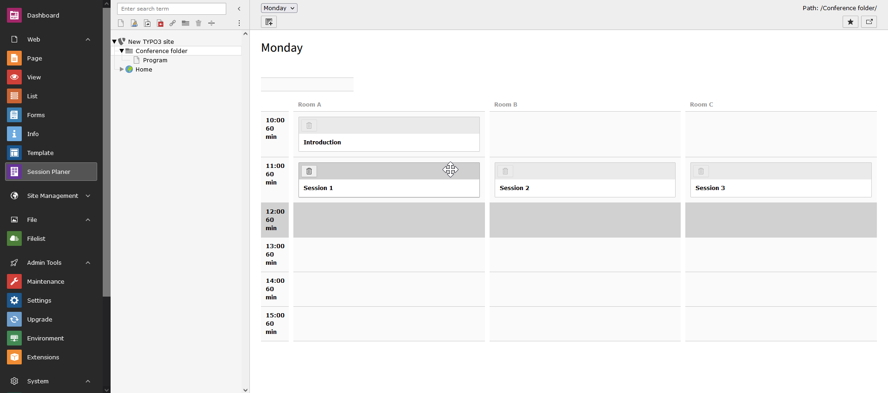
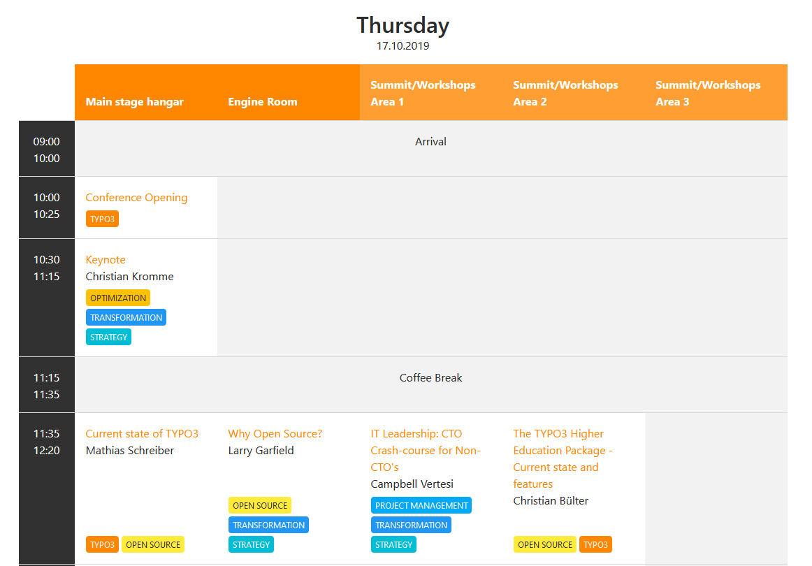

.. include:: ../Includes.txt

.. _introduction:

============
Introduction
============

What does it do?
----------------

In the backend a module assists the planing process by adding sessions
in a grid of all possible time slots and available rooms. It helps keeping
an overview of which slots are booked and which are free.

In frontend the session plan is rendered in a table style. For example look
at the following screenshot from the `T3CON19 <https://t3con19.typo3.com/program>`__:

Features
--------

*  supports multi-day conferences
*  mobile-friendly view of the program schedule
*  separate page for each session and each speaker
*  detailed speaker information can be entered like affiliation, bio, social media information as well as a picture
*  list of speakers
*  each session can have one or several tags in different colors
*  link external or internal material for a session
*  download all data as CSV or JSON from the backend
