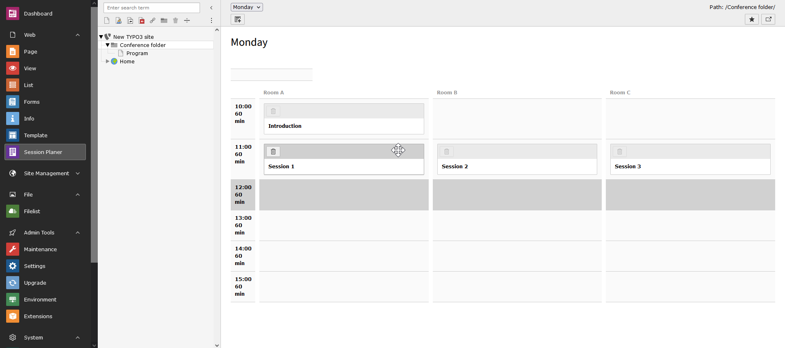

.. include:: /Includes.rst.txt

..  _tutorial:

========
Tutorial
========

Preparation for planing
=======================

To be able to plan sessions you need to add the following:

* a folder for the planing data
* for each day of the event you need to add a "Session Planer Day"
    - the days need to get "Slots" added to it for each slot that is available on that day
* for each room in which you are having sessions a "Session Planer Room"
    - add the "Days" to the room on which that room is available
    - the rooms need to get "Slots" added to it for each slot that is available in that room
* edit each day and add the rooms that are available on that day
* in the "Session Planer" module, you should now have a grid comparable the screenshot

Configuring the frontend
========================

For the frontend you need at least one page with a plugin of type "Sessionplaner: Sessionplan".

For more complex needs you need to play with the other modules:

* "Sessionplaner: Session"
* "Sessionplaner: Tag"
* "Sessionplaner: Speakers"
* "Sessionplaner: Suggest Sessions"

Each plugin comes with it's own settings as plugin options and do not need to be configured in TypoScript.

TypoScript is only needed to override the templates, partials or layouts. These can be configured with constants:

* `plugin.tx_sessionplaner.view.templateRootPath`
* `plugin.tx_sessionplaner.view.partialRootPath`
* `plugin.tx_sessionplaner.view.layoutRootPath`

There is one exemption from this and that is the "Suggest Sessions" plugin. The form for that is configured
within the `plugin.tx_sessionplaner.settings.suggest` key. Take a deeper look into
Configuration/TypoScript/setup.typoscript
